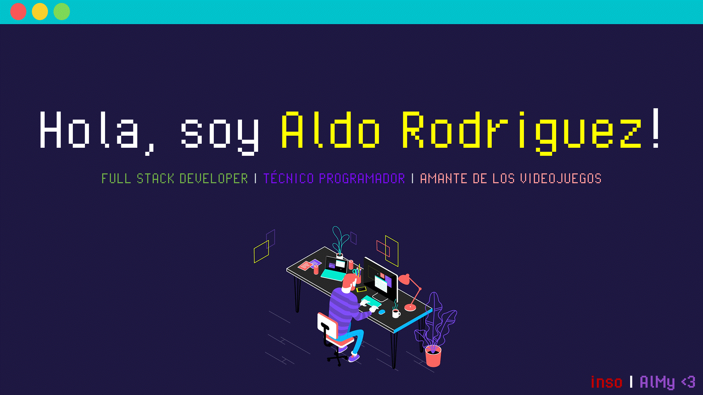

 
  Visitantes 
  

### 👋 Hola mundo!

Mi nombre es Aldo, actualmente soy un estudiante de la carrera en ingenieria en sistemas computacionales, me encanta la programación, los videojuegos, escuchar musica, ver anime, estudiar y el aprendizaje constante.

### 🧐 Algunos datos sobre mi
- 💼 Trabajo en AutoAzur.
- ✍️ Mi aprendizaje se basa mucho en ver y aplicar lo que veo (soy demasiado visual).
- 😄 Mis nicknames: inso / insomniac
- 🖥️ Ambiente de codificación: Dark 🕶️ + Musica 🎧 .
- ⚡ Datos divertidos: Me dicen que soy muy serio o antisocial pero es puro show jajajaj ;)
- 💬 Frases favoritas:
- > "No es vergüenza no saber, sino saber que no sabes y no querer saber" - Bruno Lopez Takeyas.
- > "Solo existe un bien: el conocimiento. Solo hay un mal: la ignorancia" Sócrates.
- > "No hay que ser grande para empezar, pero hay que empezar para ser grande" - Zig Ziglar.

### 👼 Si
Muchas gracias por leer mi README, al paracer si soy algo interesante ;) ...

### 🧰 Mis habilidades y softwares que he utilizado

